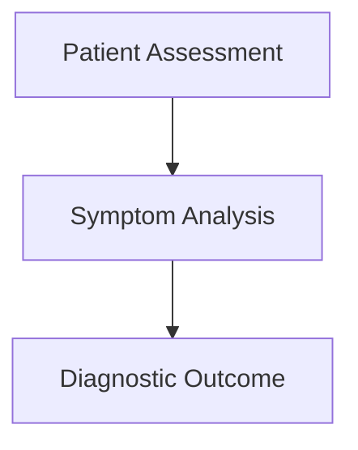

# CareNest Mobile
### Localized Medical Intelligence & Diagnostic Instrument

CareNest is a production-grade medical investigative tool designed for professional practitioners. Unlike traditional chatbots, CareNest delivers clinical diagnostic insights as structured, full-width medical reports—completely offline and private on your mobile device.


## 🩺 Core Philosophy
CareNest rejects the "chat bubble" paradigm in favor of **investigative reporting**. It treats every interaction as a clinical consultation, producing structured Markdown documents with embedded diagnostic paths and high-fidelity medical tables.

## 🚀 Key Features
- **Local-First Inference**: Powered by a custom `llama.cpp` native FFI layer optimized for the **Snapdragon 8 Gen 2**.
- **Clinical Dashboard**: A clean, full-width UI built for maximum readability and zero-distraction medical investigative work.
- **Diagnostic Flowcharts**: Dynamic rendering of vertical Mermaid diagrams for visualizing clinical paths and symptom logic.
- **Wide-Column Data**: Professional rendering of complex medical reference tables with horizontal scrolling and fixed-width columns.
- **Privacy Core**: 100% offline generation. No health data ever leaves the device.

## 🛠️ Architecture
The mobile application is split into a high-performance Dart UI and a hardened C++ native backend:
- **`lib/`**: Flutter UI layer implementing the **Outfit** medical design system.
- **`lib/llama_service.dart`**: FFI bridge to the native engine.
- **`native/`**: Lightweight wrapper around `llama.cpp` (GGUF support).
- **`android/`**: Configured to load optimized ARMv8-A / NEON instructions.

---

## 📥 Setup Instructions

### 1. Prerequisites
Ensure your development environment meets these requirements:
- **Flutter SDK**: `^3.11.4`
- **Android NDK**: `25.x` or higher
- **CMake**: `3.22.1`+ (for native compilation)
- **Device**: Android device with 8GB+ RAM recommended (optimized for Snapdragon 8 Gen 2).

### 2. Native Library Preparation
Before running the Flutter app, you must compile the native `llama.cpp` wrapper. 

1. Navigate to the native directory (root of the repo).
2. Compile the libraries for `arm64-v8a`.
3. Copy the resulting `.so` files into:
   `care_nest_mobile/android/app/src/main/jniLibs/arm64-v8a/`
   
Required libraries:
- `libomp.so`
- `libggml.so`
- `libllama.so`
- `libwrapper.so`

### 3. Flutter Initialization
```bash
# Navigate to the mobile project
cd care_nest_mobile

# Fetch dependencies
flutter pub get

# Build and run
flutter run --release
```

### 4. On-Device Setup
Upon first launch, CareNest will enter **Core Initialization**.
- The app will download the **Gemma 4** quantized model (approx 3GB-5GB).
- This is a one-time setup requiring an internet connection.
- Once completed, the app switches to **100% Offline Mode**.

---

## 📊 Diagnostic Rendering Engine
CareNest uses a specialized Markdown rendering engine:

### Vertical Flowcharts
Diagnostics follow a strict top-to-bottom clinical hierarchy. 


### Wide Medical Tables
Reference data (e.g., blood chemistry, diet plans) is rendered in a full-width scrolling widget to prevent text wrapping that compromises clinical accuracy.

---

## ⚖️ License & Disclaimer
This software is intended for **research and educational purposes only**. It is not a replacement for professional medical advice, diagnosis, or treatment.

Licensed under the **MIT License**.
